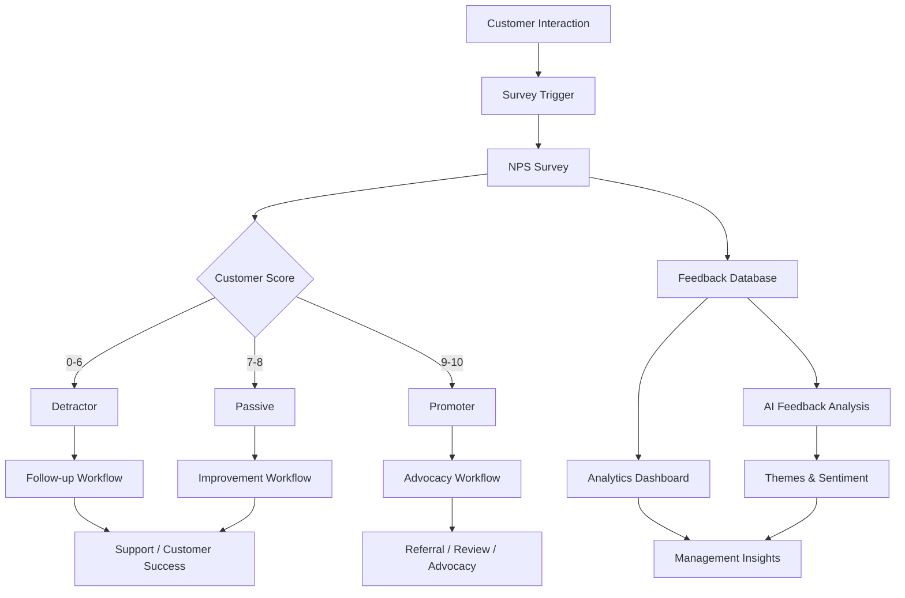
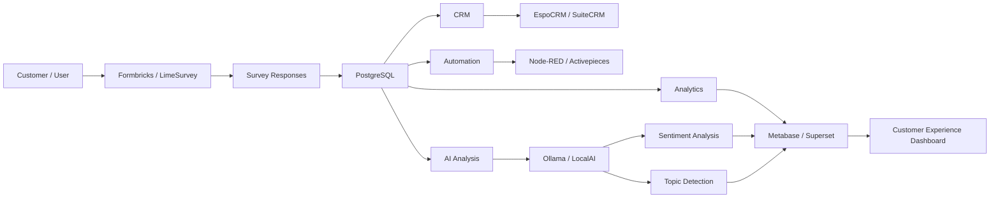

# Awesome-Net-Promoter-Score-Platform

## Top Net Promoter Score (NPS) Platform Ecosystem

**Curated List of SaaS Products & Open-Source GitHub Projects**

*Focused on Net Promoter Score (NPS), Customer Feedback, Customer Experience (CX), Survey Automation, Feedback Analytics & Experience Management*

**Last updated: August 2026**

This repository tracks notable **SaaS/hosted platforms** and **open-source projects** for **Net Promoter Score (NPS) and Customer Feedback Management**. These platforms help organizations collect, measure, analyze and act on customer feedback through NPS, CSAT, CES and other survey methodologies across email, web, mobile, in-product and other digital channels.

**Examples** include Delighted, Promoter.io, AskNicely, Retently, Survicate, Zonka Feedback, CustomerGauge, Medallia, Qualtrics and InMoment.

**Open-source emphasis**: This section is heavily expanded with major self-hosted survey platforms, customer-feedback systems, in-app survey tools, form builders, feature-request platforms, customer-insight tools and supporting analytics infrastructure. While relatively few open-source projects are complete one-to-one replacements for enterprise NPS and Experience Management platforms such as Medallia or Qualtrics, a strong open-source stack can provide NPS collection, feedback segmentation, response analytics, automation and customer follow-up without depending entirely on proprietary SaaS vendors.

Contributions welcome! Open a PR to add/update entries. Keep descriptions factual and link to official sites or GitHub repositories.

## Table of Contents

* [SaaS/Hosted Platforms](#saashosted-platforms)

* [Open-Source GitHub Projects](#open-source-github-projects)

* [Additional Strong Open-Source Options](#additional-strong-open-source-options)

* [Frameworks for Building Custom NPS Platforms](#frameworks-for-building-custom-nps-platforms)

* [How to Contribute](#how-to-contribute)

* [Disclaimer](#disclaimer)

## SaaS/Hosted Platforms

| Platform | Description | Starting Price | Free Tier Limits |
| :--- | :--- | :--- | :--- |
| **[Delighted](https://delighted.com/)** | Customer-feedback platform focused on NPS, CSAT, CES and other experience surveys across email, web and digital touchpoints. | $224/month ($19/mo on legacy starter tiers) | Free forever plan limited to 25 responses/month & 1 user seat (or 7-day free trial on paid plans) |
| **[Promoter.io](https://www.promoter.io/)** | Customer-feedback and NPS platform designed to automate survey collection, customer segmentation and follow-up workflows. | $100/month | Free forever plan limited to 25 survey responses/month; 14-day free trial on premium tiers |
| **[AskNicely](https://www.asknicely.com/)** | Customer experience platform centered around continuous NPS measurement, feedback collection and employee action workflows. | $399/month (custom quote based on volume) | No free forever plan; 14-day free trial (sales-assisted onboarding with custom volume pilot) |
| **[Retently](https://www.retently.com/)** | Customer-feedback platform specializing in NPS, CSAT and CES surveys with segmentation, automation and analytics. | $49/month (Ecommerce Basic) | No free forever plan; 14-day free trial with up to 1,000 surveys/campaign limits |
| **[Survicate](https://survicate.com/)** | Customer-insights platform supporting website, email, in-product and mobile surveys for NPS, customer satisfaction and product feedback. | $56/month (billed annually) / $89/mo | Free forever plan limited to 25 responses/month, 3 user seats, and 30-day data retention |
| **[Zonka Feedback](https://www.zonkafeedback.com/)** | Customer-feedback and experience-management platform supporting NPS, CSAT, CES, offline surveys, workflow automation and analytics. | $49/month (Starter tier) | No free forever plan; 14-day free trial with full access up to 100 survey responses |
| **[CustomerGauge](https://customergauge.com/)** | Enterprise customer-experience platform focused on B2B NPS programs, account feedback, revenue intelligence and customer success workflows. | $2,000/month ($24,000 billed annually) | No free forever plan; 60 to 90-day structured proof-of-concept / pilot program |
| **[Medallia](https://www.medallia.com/)** | Enterprise experience-management platform supporting large-scale customer, employee and digital experience measurement and analytics. | $833/month ($10,000/yr for Salesforce module / ~$20,000/yr core platform) | No free forever plan; 30-day enterprise sandbox / guided pilot with custom interaction limits |
| **[Qualtrics](https://www.qualtrics.com/)** | Major enterprise experience-management platform supporting customer experience, employee experience, market research and advanced survey analytics. | $420/month ($5,040 billed annually for Strategic Research self-serve) | Free forever plan limited to 500 total responses per user, 3 active surveys, and 30 questions/survey |
| **[InMoment](https://inmoment.com/)** | Customer-experience platform supporting feedback collection, NPS programs, experience analytics and customer journey intelligence. | $1,250/month ($15,000 billed annually + onboarding fees) | No free forever plan; 90-day Proof of Concept (POC) pilot program |
| **[SurveyMonkey](https://www.surveymonkey.com/)** | Widely used online survey platform that supports NPS, customer satisfaction, market research and feedback collection. | $39/month (Advantage Annual) / $99 monthly | Free forever Basic plan limited to 10 questions per survey and 40 viewable responses per survey |
| **[Typeform](https://www.typeform.com/)** | Conversational form and survey platform commonly used for customer-feedback and NPS programs. | $25/month (billed annually) / $29 monthly | Free forever plan limited to 10 responses/month and 10 questions per form |
| **[Jotform](https://www.jotform.com/)** | Online form and survey platform with templates and workflows suitable for customer-feedback collection. | $34/month (Bronze plan, billed annually) | Free forever Starter plan limited to 5 forms, 100 monthly submissions, and 100MB storage |
| **[Sogolytics](https://www.sogolytics.com/)** | Enterprise survey and feedback-management platform supporting customer experience and research programs. | $39/month (Pro plan) | Free forever Pro plan limited to 200 responses/year and 200 email invitations/year |
| **[Alchemer](https://www.alchemer.com/)** | Survey and feedback platform supporting customer insights, research, feedback automation and workflow integrations. | $55/user/month (Collaborator plan) | No permanent free tier; 7-day free trial limited to 100,000 responses and full Professional features |
| **[Nicereply](https://www.nicereply.com/)** | Customer-satisfaction platform focused on NPS, CSAT and CES surveys, particularly for customer-support teams. | $39/month (billed annually) / $49 monthly | No free forever plan; 14-day free trial limited to 100 survey responses across all agents |
| **[ProProfs Survey Maker](https://www.proprofs.com/survey/)** | Online survey platform supporting NPS, CSAT and general customer-feedback programs. | $7/month (billed annually) / $19 monthly | Free forever plan limited to 10 responses/month and 1 active survey |
| **[Birdeye](https://birdeye.com/)** | Customer-experience and reputation-management platform supporting surveys, customer feedback and review collection. | $299/location/month | No free forever plan; 14-day free trial limited to 1 business location |
| **[Qualaroo](https://qualaroo.com/)** | Customer-feedback and user-research platform supporting website and product surveys. | $19.99/month (Essentials) / $499/mo Business | Free forever plan limited to 50 responses/month and 1 active nudge; 15-day trial on paid tiers |
| **[Hotjar](https://www.hotjar.com/)** | Product-experience platform combining surveys, feedback widgets and behavioral analytics. | $49/month (Growth plan, billed annually) | Free forever Basic plan limited to 35 daily sessions, 20 monthly survey responses, and 3 active surveys |

## Open-Source GitHub Projects

### Complete Survey and Experience Platforms

* **[Formbricks](https://github.com/formbricks/formbricks)**

  One of the strongest open-source platforms for customer feedback and product experience. Supports website and in-app surveys, targeted feedback collection, response analytics and self-hosted deployments, making it a particularly strong foundation for custom NPS systems.

* **[LimeSurvey](https://github.com/LimeSurvey/LimeSurvey)**

  Mature open-source survey platform with extensive question types, conditional logic, multilingual support, analytics and API capabilities. A strong self-hosted alternative for NPS, CSAT, CES and broader customer-research programs.

* **[OpenSurvey](https://github.com/mohitbadwal/opensurvey)**

  Open-source, self-hosted survey and experience-management platform with visual survey creation, conditional logic, analytics, contacts, segments, teams and built-in NPS question support.

* **[HeyForm](https://github.com/heyform/heyform)**

  Open-source form and survey builder suitable for collecting NPS and customer feedback through shareable and embeddable surveys.

* **[OpnForm](https://github.com/JhumanJ/OpnForm)**

  Open-source form builder and self-hosted survey platform suitable for creating branded customer-feedback and satisfaction surveys.

* **[Yakforms](https://github.com/Yakforms/yakforms)**

  Open-source form and survey platform that can be self-hosted for independent customer-feedback and questionnaire workflows.

* **[GetInput](https://github.com/getinput/getinput)**

  Open-source survey and feedback platform suitable for collecting structured responses and building self-hosted feedback workflows.

### Survey Frameworks and Embedded NPS Builders

* **[SurveyJS](https://github.com/surveyjs/survey-library)**

  Open-source survey library for embedding highly customizable surveys directly into websites and applications. A strong choice for developers building a completely custom NPS experience.

* **[SurveyJS Form Library](https://github.com/surveyjs/survey-library)**

  Flexible JavaScript survey-rendering library supporting custom question types, conditional logic and application-level integration.

* **[Form.io](https://github.com/formio/formio)**

  Open-source form and data-management framework suitable for building embedded customer-feedback and NPS applications.

* **[React Hook Form](https://github.com/react-hook-form/react-hook-form)**

  Popular open-source React form framework that can be used to build custom NPS and customer-feedback interfaces.

* **[FormKit](https://github.com/formkit/formkit)**

  Open-source form-building framework useful for creating custom feedback and survey experiences.

* **[JSON Forms](https://github.com/eclipsesource/jsonforms)**

  Open-source framework for generating forms from JSON schemas, useful for structured feedback systems.

### Product Feedback and Customer Suggestion Platforms

* **[Fider](https://github.com/getfider/fider)**

  Major open-source customer-feedback platform supporting feature requests, voting and feedback prioritization. Useful as a complement to NPS systems for collecting qualitative customer suggestions.

* **[ClearFlask](https://github.com/clearflask/clearflask)**

  Open-source customer-feedback and feature-request platform supporting feedback collection, voting and roadmap-style workflows.

* **[Sleekplan Alternatives](https://github.com/search?q=open+source+feedback+roadmap&type=repositories)**

  Community-maintained open-source feedback boards, feature-request systems and customer voting tools.

* **[Nolt Alternatives](https://github.com/search?q=open+source+feature+request+platform&type=repositories)**

  Community projects supporting feature requests, voting, customer feedback and public roadmap workflows.

### Customer Support and Feedback Collection

* **[Chatwoot](https://github.com/chatwoot/chatwoot)**

  Open-source customer-engagement and support platform that can complement NPS programs by connecting customer conversations with feedback workflows.

* **[Zammad](https://github.com/zammad/zammad)**

  Open-source help-desk and customer-support platform suitable for triggering satisfaction surveys after support interactions.

* **[FreeScout](https://github.com/freescout-helpdesk/freescout)**

  Lightweight open-source help-desk platform that can be integrated with NPS and customer-satisfaction workflows.

* **[UVdesk Community](https://github.com/uvdesk/community-skeleton)**

  Open-source customer-support and ticket-management platform suitable for post-interaction feedback collection.

* **[Peppermint](https://github.com/Peppermint-Lab/peppermint)**

  Open-source help-desk platform that can be extended with customer-feedback and satisfaction workflows.

### Form and Feedback Collection Platforms

* **[Nextcloud Forms](https://github.com/nextcloud/forms)**

  Open-source form application for self-hosted environments, suitable for internal and external feedback collection.

* **[OhMyForm](https://github.com/ohmyform/ohmyform)**

  Open-source form builder that can be self-hosted for independent customer-feedback collection.

* **[TellForm](https://github.com/tellform/tellform)**

  Open-source form and survey project that can serve as a base for customized feedback workflows.

* **[Drupal Webform](https://www.drupal.org/project/webform)**

  Powerful open-source form ecosystem for Drupal, capable of building sophisticated customer surveys and feedback programs.

* **[WordPress Form Ecosystem](https://github.com/WordPress/WordPress)**

  Open-source publishing infrastructure that can be extended with survey and feedback plugins for custom NPS deployments.

### Workflow Automation and Survey Follow-Up

* **[n8n](https://github.com/n8n-io/n8n)**

  Source-available workflow automation platform widely used to connect surveys with CRMs, email platforms, databases, Slack and other business systems.

* **[Node-RED](https://github.com/node-red/node-red)**

  Open-source flow-based automation platform useful for triggering NPS surveys and automating feedback routing.

* **[Activepieces](https://github.com/activepieces/activepieces)**

  Open-source workflow automation platform suitable for survey-triggering, response routing and follow-up workflows.

* **[Huginn](https://github.com/huginn/huginn)**

  Open-source automation platform capable of monitoring events, processing feedback and triggering customer follow-up actions.

* **[Automatisch](https://github.com/automatisch/automatisch)**

  Open-source workflow automation platform for connecting feedback systems, databases and business applications.

### CRM and Customer Segmentation

* **[EspoCRM](https://github.com/espocrm/espocrm)**

  Open-source CRM that can store customer profiles, NPS scores, survey history and follow-up activities.

* **[SuiteCRM](https://github.com/salesagility/SuiteCRM)**

  Mature open-source CRM suitable for integrating NPS data with customer accounts, opportunities and service workflows.

* **[Odoo CRM](https://github.com/odoo/odoo)**

  Open-source business platform with CRM modules that can be extended to manage survey results and customer-experience workflows.

* **[Twenty](https://github.com/twentyhq/twenty)**

  Open-source CRM platform suitable for connecting customer records with feedback and survey responses.

* **[Monica CRM](https://github.com/monicahq/monica)**

  Open-source relationship-management platform that can serve as a lightweight customer relationship and follow-up layer.

### Analytics and Customer Insight Infrastructure

* **[Metabase](https://github.com/metabase/metabase)**

  Open-source business-intelligence platform ideal for creating NPS dashboards, trend analysis and customer-feedback reports.

* **[Apache Superset](https://github.com/apache/superset)**

  Enterprise-grade open-source analytics platform suitable for advanced NPS and customer-experience dashboards.

* **[Grafana](https://github.com/grafana/grafana)**

  Open-source visualization platform that can display real-time NPS trends and operational customer-feedback metrics.

* **[Redash](https://github.com/getredash/redash)**

  Open-source analytics and dashboard platform useful for exploring survey-response databases.

* **[PostHog](https://github.com/PostHog/posthog)**

  Open-source product-analytics platform that can complement NPS surveys with behavioral product data and user segmentation.

* **[Matomo](https://github.com/matomo-org/matomo)**

  Open-source web analytics platform useful for connecting customer feedback with website and digital experience behavior.

### Search and Feedback Data Management

* **[OpenSearch](https://github.com/opensearch-project/OpenSearch)**

  Open-source search and analytics platform suitable for indexing and analyzing large volumes of customer comments and survey responses.

* **[Meilisearch](https://github.com/meilisearch/meilisearch)**

  Open-source search engine useful for fast searching across qualitative customer-feedback archives.

* **[Apache Solr](https://github.com/apache/solr)**

  Mature open-source enterprise search platform suitable for large customer-feedback repositories.

* **[PostgreSQL](https://github.com/postgres/postgres)**

  Open-source relational database frequently used as the core storage layer for self-hosted survey and NPS systems.

### AI-Assisted Feedback Analysis

* **[Ollama](https://github.com/ollama/ollama)**

  Open-source local AI platform useful for analyzing customer comments, summarizing feedback and identifying recurring themes without sending sensitive feedback to external AI services.

* **[LocalAI](https://github.com/mudler/LocalAI)**

  Open-source local AI platform providing self-hosted language-model capabilities for feedback analysis and automation.

* **[LangChain](https://github.com/langchain-ai/langchain)**

  Open-source framework for building AI applications capable of categorizing, summarizing and analyzing customer feedback.

* **[LangGraph](https://github.com/langchain-ai/langgraph)**

  Open-source framework for building multi-step AI workflows for customer-feedback processing and automated follow-up.

* **[Haystack](https://github.com/deepset-ai/haystack)**

  Open-source framework for semantic search, retrieval and AI-assisted analysis of large feedback collections.

* **[BERTopic](https://github.com/MaartenGr/BERTopic)**

  Open-source topic-modeling framework useful for automatically discovering themes in large collections of customer comments.

* **[spaCy](https://github.com/explosion/spaCy)**

  Open-source natural-language-processing library suitable for sentiment analysis, entity extraction and text classification.

* **[Transformers](https://github.com/huggingface/transformers)**

  Major open-source machine-learning library supporting sentiment analysis and natural-language understanding for customer-feedback datasets.

## Additional Strong Open-Source Options

* **Dedicated survey platforms**: Formbricks, LimeSurvey, OpenSurvey, HeyForm, OpnForm and Yakforms.

* **Embedded survey frameworks**: SurveyJS, Form.io, JSON Forms, FormKit and custom React form stacks.

* **Customer feedback boards**: Fider, ClearFlask and community feature-request platforms.

* **Customer support integration**: Chatwoot, Zammad, FreeScout, UVdesk and Peppermint.

* **Self-hosted forms**: Nextcloud Forms, OhMyForm, TellForm and Drupal Webform.

* **Customer relationship management**: EspoCRM, SuiteCRM, Odoo CRM and Twenty.

* **Workflow automation**: Node-RED, n8n, Activepieces, Huginn and Automatisch.

* **Analytics and dashboards**: Metabase, Apache Superset, Grafana and Redash.

* **Product and behavioral analytics**: PostHog and Matomo.

* **Feedback search**: OpenSearch, Meilisearch and Apache Solr.

* **AI feedback analysis**: Ollama, LocalAI, LangChain, LangGraph, Haystack, BERTopic and spaCy.

* Many additional open-source projects exist for **forms, questionnaires, polling, sentiment analysis, text classification, topic modeling and customer-support automation**.

**Important distinction**: Most proprietary NPS vendors bundle survey delivery, customer segmentation, analytics, automated follow-up, CRM integrations and AI insights into one platform. Open-source alternatives are often modular, allowing organizations to assemble a customized stack with greater data ownership and flexibility.

## Frameworks for Building Custom NPS Platforms

A practical open-source NPS architecture can combine:

**Survey Engine** → Formbricks / LimeSurvey / OpenSurvey

**Embedded Surveys** → SurveyJS / Form.io

**Customer CRM** → EspoCRM / SuiteCRM / Twenty

**Support Integration** → Chatwoot / Zammad / FreeScout

**Workflow Automation** → Node-RED / Activepieces / Huginn

**Customer Analytics** → PostHog / Matomo

**Business Intelligence** → Metabase / Apache Superset / Grafana

**Feedback Search** → OpenSearch / Meilisearch

**AI Analysis** → Ollama / LocalAI

**AI Workflow** → LangChain / LangGraph

**Topic Analysis** → BERTopic / spaCy / Transformers

A strong self-hosted NPS stack could be:

**Formbricks + EspoCRM + Activepieces + PostgreSQL + Metabase**

For a product-led SaaS company:

**Formbricks + PostHog + Twenty + n8n + Grafana**

For a privacy-focused enterprise:

**LimeSurvey + SuiteCRM + PostgreSQL + Apache Superset + Ollama**

For advanced qualitative feedback analysis:

**Formbricks + OpenSearch + BERTopic + Ollama + Metabase**

## NPS Feedback Workflow

## Open-Source NPS Architecture

## Net Promoter Score Calculation

The standard NPS calculation is:

**NPS = % Promoters − % Detractors**

Typical categories are:

* **Promoters**: Score 9–10

* **Passives**: Score 7–8

* **Detractors**: Score 0–6

NPS values range from:

**−100 to +100**

Passives do not directly affect the mathematical NPS score, but they remain important for customer-retention and experience-improvement analysis.

## Common NPS Platform Features

A complete NPS and customer-feedback platform may support:

* NPS surveys

* CSAT surveys

* CES surveys

* Website surveys

* In-app surveys

* Email surveys

* Mobile surveys

* SMS surveys

* Survey automation

* Customer segmentation

* Contact management

* Event-based survey triggering

* Response analytics

* NPS calculation

* Trend analysis

* Customer comments

* Qualitative feedback

* Sentiment analysis

* Topic classification

* Detractor alerts

* Promoter identification

* Automated follow-up

* CRM integration

* Help-desk integration

* Product analytics integration

* API access

* Webhooks

* Dashboard reporting

* Multi-language surveys

* Role-based access control

* Data export

* Data anonymization

* AI-assisted insights

## NPS and Customer Experience Data Model

A typical NPS platform may include:

* Customer

* Contact

* Account

* Survey

* Survey Question

* Survey Response

* NPS Score

* NPS Category

* Promoter

* Passive

* Detractor

* Feedback Comment

* Feedback Topic

* Sentiment

* Customer Segment

* Product

* Interaction

* Support Ticket

* Follow-up Task

* Customer Success Activity

* Survey Trigger

* Automation Rule

* Campaign

* Channel

* Email

* Web Session

* In-App Event

* Date

* Time

* Metadata

## AI-Assisted Customer Feedback Analysis

Open-source AI systems can support:

* Sentiment analysis

* Comment classification

* Topic clustering

* Theme discovery

* Complaint detection

* Product-request extraction

* Customer churn-risk signals

* Detractor analysis

* Promoter analysis

* Response summarization

* Duplicate-feedback detection

* Emerging trend detection

* Feedback routing

* Suggested customer follow-ups

* Executive summaries

* Natural-language analytics queries

A privacy-oriented architecture can be:

**Customer Feedback → PostgreSQL / OpenSearch → Local AI Model → Human Review → Customer Action**

Organizations handling sensitive customer data should carefully review privacy, security and data-retention requirements.

## NPS and Customer Experience KPIs

Useful metrics include:

* Overall NPS

* NPS trend

* Promoter percentage

* Passive percentage

* Detractor percentage

* Survey response rate

* Survey completion rate

* Feedback volume

* Detractor follow-up time

* Promoter conversion rate

* Customer satisfaction score

* Customer effort score

* Sentiment score

* Customer churn rate

* Retention rate

* Repeat purchase rate

* Product satisfaction

* Support satisfaction

* Feature satisfaction

* Account-level NPS

* Segment-level NPS

* Region-level NPS

* Product-level NPS

* Customer lifetime value correlation

## How to Contribute

1. Fork the repo.

2. Add/edit entries in `README.md` following the existing format.

3. Include: name, link, a 1–2 sentence description and whether it is SaaS/hosted or open-source.

4. Clearly indicate whether an open-source project is a complete survey platform, embedded survey framework, CRM, feedback tool or supporting analytics component.

5. Prefer actively maintained projects with clear licenses and documentation.

6. Submit a PR with a short explanation.

Star the repo if you find it useful!

## Disclaimer

* This is a **community-curated** list — not exhaustive and not an endorsement.

* NPS is one customer-experience metric and should not be treated as the sole indicator of customer loyalty or business health.

* Survey methodology, sampling bias, survey timing and response rates can significantly affect NPS results.

* Open-source alternatives may require integration work to match the automation and enterprise workflow capabilities of commercial NPS platforms.

* AI-generated sentiment analysis and summaries may contain errors and should be reviewed before making important customer or business decisions.

* Organizations collecting customer feedback should comply with applicable privacy and data-protection regulations.

* Self-hosted systems require appropriate access controls, encryption, backups, monitoring and security maintenance.

---

**Made for customer success teams, product managers, CX leaders, SaaS companies, researchers, developers and organizations building open customer-feedback ecosystems.**

Let's make customer feedback more **open, privacy-friendly, actionable, interoperable and data-driven**.
