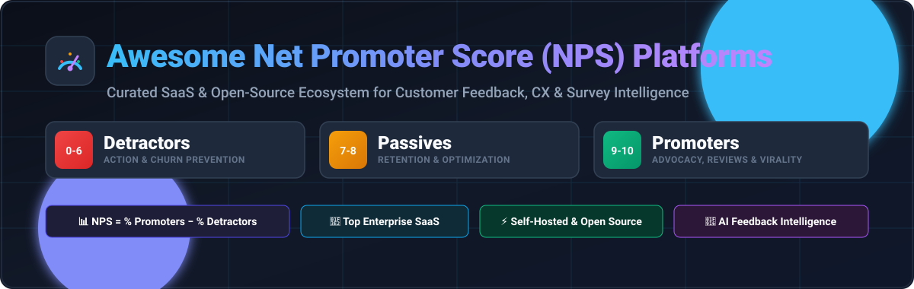
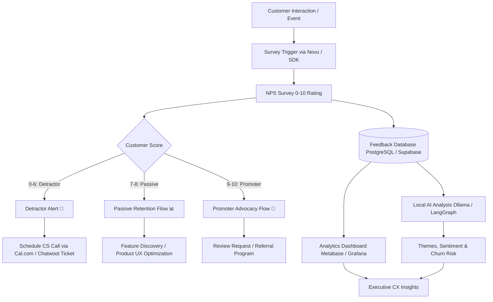
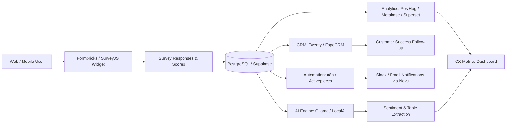

# 🌟 Awesome Net Promoter Score (NPS) Platform Ecosystem 🚀

<p align="center">
  
</p>

<p align="center">
  <a href="https://github.com/ishandutta2007/Awesome-Awesome-Awesome"></a><a href="https://discord.gg/jc4xtF58Ve"></a>
  <a href="https://github.com/ishandutta2007/Awesome-Net-Promoter-Score-Platform/stargazers"></a>
  <a href="https://github.com/ishandutta2007/Awesome-Net-Promoter-Score-Platform/network/members"></a>
  <a href="https://github.com/ishandutta2007/Awesome-Net-Promoter-Score-Platform/issues"></a>
  <a href="https://github.com/ishandutta2007/Awesome-Net-Promoter-Score-Platform/blob/main/LICENSE"></a>
  <a href="https://github.com/ishandutta2007"></a>
</p>

---

## 📖 Overview & Ecosystem Summary

> **Curated Directory of Top SaaS Products & Open-Source GitHub Projects**  
> *Targeted at Net Promoter Score (NPS), Customer Satisfaction (CSAT), Customer Effort Score (CES), Voice of Customer (VoC), Survey Automation, In-Product Micro-surveys, and Experience Analytics.*

**Last updated: August 2026**

This repository tracks notable **SaaS/hosted platforms** and **open-source projects** for **Net Promoter Score (NPS) and Customer Feedback Management**. These platforms empower organizations, product leaders, CX managers, and engineers to collect, measure, benchmark, and act on customer feedback across email, web widgets, mobile SDKs, in-product nudges, and omnichannel touchpoints.

### 💡 Open-Source & Self-Hosted Stack
While enterprise Experience Management (XM) platforms like Qualtrics or Medallia bundle the entire feedback loop, an open-source architecture (combining tools like **Formbricks**, **PostHog**, **Twenty CRM**, **n8n**, and local **Ollama** AI models) offers complete data privacy, GDPR compliance, zero vendor lock-in, and custom flexibility.

---

## 📑 Table of Contents
* [🏢 SaaS / Hosted Platforms](#-saashosted-platforms)
* [💻 Open-Source GitHub Projects](#-open-source-github-projects)
  * [🎯 Complete Survey and Experience Platforms](#-complete-survey-and-experience-platforms)
  * [🛠️ Survey Frameworks and Embedded NPS Builders](#️-survey-frameworks-and-embedded-nps-builders)
  * [💡 Product Feedback and Customer Suggestion Platforms](#-product-feedback-and-customer-suggestion-platforms)
  * [🎧 Customer Support and Feedback Collection](#-customer-support-and-feedback-collection)
  * [📝 Form and Feedback Collection Platforms](#-form-and-feedback-collection-platforms)
  * [⚡ Workflow Automation and Survey Follow-Up](#-workflow-automation-and-survey-follow-up)
  * [👥 CRM and Customer Segmentation](#-crm-and-customer-segmentation)
  * [📊 Analytics and Customer Insight Infrastructure](#-analytics-and-customer-insight-infrastructure)
  * [🔍 Search and Feedback Data Management](#-search-and-feedback-data-management)
  * [🤖 AI-Assisted Feedback Analysis](#-ai-assisted-feedback-analysis)
  * [📱 Low-Code & Operational Experience Infrastructure](#-low-code--operational-experience-infrastructure)
* [🌟 Additional Strong Open-Source Options](#-additional-strong-open-source-options)
* [🏗️ Frameworks for Building Custom NPS Platforms](#️-frameworks-for-building-custom-nps-platforms)
* [🔄 NPS Feedback Workflow](#-nps-feedback-workflow)
* [📐 Open-Source NPS Architecture](#-open-source-nps-architecture)
* [🧮 Net Promoter Score Calculation](#-net-promoter-score-calculation)
* [⚙️ Common NPS Platform Features](#️-common-nps-platform-features)
* [🧱 NPS and Customer Experience Data Model](#-nps-and-customer-experience-data-model)
* [🧠 AI-Assisted Customer Feedback Analysis](#-ai-assisted-customer-feedback-analysis)
* [🎯 NPS and Customer Experience KPIs](#-nps-and-customer-experience-kpis)
* [📈 Star History](#-star-history)
* [🤝 How to Contribute](#-how-to-contribute)
* [⚖️ Disclaimer](#️-disclaimer)

---

## 🏢 SaaS/Hosted Platforms

The global **Customer Experience Management (CEM)** market is estimated at **$16B–$26B in 2026** (with the specialized NPS software market at **~$1B–$2B**), characterized by **moderate fragmentation**: top enterprise giants (Qualtrics, Medallia) command large multi-million enterprise contracts, while a wide, highly fragmented ecosystem of mid-market and niche SaaS tools compete across self-serve survey automation, product analytics, and SMB customer feedback.

| Platform | Description | Company Size (Valuation / Revenue) | Starting Price | Free Tier Limits |
| :--- | :--- | :--- | :--- | :--- |
| **[Qualtrics](https://www.qualtrics.com/)** | Major enterprise experience-management platform supporting customer experience, employee experience, market research and advanced survey analytics. | **$12.5B Valuation** (~$1.46B Revenue) | $420/month ($5,040 billed annually for Strategic Research self-serve) | Free forever plan limited to 500 total responses per user, 3 active surveys, and 30 questions/survey |
| **[Medallia](https://www.medallia.com/)** | Enterprise experience-management platform supporting large-scale customer, employee and digital experience measurement and analytics. | **$6.4B Valuation** (~$477M Revenue) | $833/month ($10,000/yr for Salesforce module / ~$20,000/yr core platform) | No free forever plan; 30-day enterprise sandbox / guided pilot with custom interaction limits |
| **[Hotjar](https://www.hotjar.com/)** *(Contentsquare)* | Product-experience platform combining surveys, feedback widgets and behavioral analytics. | **$5.6B Parent Valuation** (~$27M Hotjar ARR) | $49/month (Growth plan, billed annually) | Free forever Basic plan limited to 35 daily sessions, 20 monthly survey responses, and 3 active surveys |
| **[SurveyMonkey](https://www.surveymonkey.com/)** *(Momentive)* | Widely used online survey platform that supports NPS, customer satisfaction, market research and feedback collection. | **$1.5B Valuation** (~$481M Revenue) | $39/month (Advantage Annual) / $99 monthly | Free forever Basic plan limited to 10 questions per survey and 40 viewable responses per survey |
| **[Typeform](https://www.typeform.com/)** | Conversational form and survey platform commonly used for customer-feedback and NPS programs. | **$935M Valuation** (~$141M ARR) | $25/month (billed annually) / $29 monthly | Free forever plan limited to 10 responses/month and 10 questions per form |
| **[Birdeye](https://birdeye.com/)** | Customer-experience and reputation-management platform supporting surveys, customer feedback and review collection. | **$600M Valuation** (~$100M+ ARR) | $299/location/month | No free forever plan; 14-day free trial limited to 1 business location |
| **[Jotform](https://www.jotform.com/)** | Online form and survey platform with templates and workflows suitable for customer-feedback collection. | **~$150M+ ARR** (Bootstrapped Leader) | $34/month (Bronze plan, billed annually) | Free forever Starter plan limited to 5 forms, 100 monthly submissions, and 100MB storage |
| **[InMoment](https://inmoment.com/)** | Customer-experience platform supporting feedback collection, NPS programs, experience analytics and customer journey intelligence. | **~$120M+ ARR** (PE-backed / PG Forsta) | $1,250/month ($15,000 billed annually + onboarding fees) | No free forever plan; 90-day Proof of Concept (POC) pilot program |
| **[Delighted](https://delighted.com/)** *(Qualtrics)* | Customer-feedback platform focused on NPS, CSAT, CES and other experience surveys across email, web and digital touchpoints. | **~$50M+ Division** (Acquired by Qualtrics) | $224/month ($19/mo on legacy starter tiers) | Free forever plan limited to 25 responses/month & 1 user seat (or 7-day free trial on paid plans) |
| **[ProProfs Survey Maker](https://www.proprofs.com/survey/)** | Online survey platform supporting NPS, CSAT and general customer-feedback programs. | **~$38.9M Revenue** | $7/month (billed annually) / $19 monthly | Free forever plan limited to 10 responses/month and 1 active survey |
| **[Alchemer](https://www.alchemer.com/)** | Survey and feedback platform supporting customer insights, research, feedback automation and workflow integrations. | **~$35M ARR** (Bootstrapped / Private) | $55/user/month (Collaborator plan) | No permanent free tier; 7-day free trial limited to 100,000 responses and full Professional features |
| **[CustomerGauge](https://customergauge.com/)** | Enterprise customer-experience platform focused on B2B NPS programs, account feedback, revenue intelligence and customer success workflows. | **~$25M Valuation** (~$5.1M ARR) | $2,000/month ($24,000 billed annually) | No free forever plan; 60 to 90-day structured proof-of-concept / pilot program |
| **[AskNicely](https://www.asknicely.com/)** | Customer experience platform centered around continuous NPS measurement, feedback collection and employee action workflows. | **~$20M Valuation** (~$10.6M ARR) | $399/month (custom quote based on volume) | No free forever plan; 14-day free trial (sales-assisted onboarding with custom volume pilot) |
| **[Sogolytics](https://www.sogolytics.com/)** | Enterprise survey and feedback-management platform supporting customer experience and research programs. | **~$11.4M ARR** (Bootstrapped) | $39/month (Pro plan) | Free forever Pro plan limited to 200 responses/year and 200 email invitations/year |
| **[Survicate](https://survicate.com/)** | Customer-insights platform supporting website, email, in-product and mobile surveys for NPS, customer satisfaction and product feedback. | **~$10M Valuation** (~$4.4M ARR) | $56/month (billed annually) / $89/mo | Free forever plan limited to 25 responses/month, 3 user seats, and 30-day data retention |
| **[Zonka Feedback](https://www.zonkafeedback.com/)** | Customer-feedback and experience-management platform supporting NPS, CSAT, CES, offline surveys, workflow automation and analytics. | **~$8M Valuation** (~$3.4M ARR) | $49/month (Starter tier) | No free forever plan; 14-day free trial with full access up to 100 survey responses |
| **[Qualaroo](https://qualaroo.com/)** | Customer-feedback and user-research platform supporting website and product surveys. | **~$5M Valuation** (~$1.3M ARR) | $19.99/month (Essentials) / $499/mo Business | Free forever plan limited to 50 responses/month and 1 active nudge; 15-day trial on paid tiers |
| **[Nicereply](https://www.nicereply.com/)** | Customer-satisfaction platform focused on NPS, CSAT and CES surveys, particularly for customer-support teams. | **~$2.5M Valuation** (~$660K ARR) | $39/month (billed annually) / $49 monthly | No free forever plan; 14-day free trial limited to 100 survey responses across all agents |
| **[Retently](https://www.retently.com/)** | Customer-feedback platform specializing in NPS, CSAT and CES surveys with segmentation, automation and analytics. | **~$2M Valuation** (Estimated <$1M ARR) | $49/month (Ecommerce Basic) | No free forever plan; 14-day free trial with up to 1,000 surveys/campaign limits |
| **[Promoter.io](https://www.promoter.io/)** | Customer-feedback and NPS platform designed to automate survey collection, customer segmentation and follow-up workflows. | **~$1.5M Valuation** (Estimated <$1M ARR) | $100/month | Free forever plan limited to 25 survey responses/month; 14-day free trial on premium tiers |

---

## 💻 Open-Source GitHub Projects

### 🎯 Complete Survey and Experience Platforms

* **[Formbricks](https://github.com/formbricks/formbricks)** [](https://github.com/formbricks/formbricks/stargazers)  
  One of the strongest open-source platforms for customer feedback and product experience. Supports website and in-app surveys, targeted feedback collection, response analytics and self-hosted deployments, making it a premier foundation for custom NPS systems.

* **[HeyForm](https://github.com/heyform/heyform)** [](https://github.com/heyform/heyform/stargazers)  
  Open-source form and survey builder suitable for collecting NPS and customer feedback through shareable, conversational, and embeddable surveys.

* **[LimeSurvey](https://github.com/LimeSurvey/LimeSurvey)** [](https://github.com/LimeSurvey/LimeSurvey/stargazers)  
  Mature open-source survey platform with extensive question types, conditional logic, multilingual support, analytics and API capabilities. A strong self-hosted alternative for NPS, CSAT, CES and broader customer-research programs.

* **[OpnForm](https://github.com/JhumanJ/OpnForm)** [](https://github.com/JhumanJ/OpnForm/stargazers)  
  Open-source form builder and self-hosted survey platform suitable for creating branded customer-feedback and satisfaction surveys with custom logic and webhooks.

* **[OpenSurvey](https://github.com/mohitbadwal/opensurvey)** [](https://github.com/mohitbadwal/opensurvey/stargazers)  
  Open-source, self-hosted survey and experience-management platform with visual survey creation, conditional logic, analytics, contacts, segments, teams and built-in NPS question support.

---

### 🛠️ Survey Frameworks and Embedded NPS Builders

* **[React Hook Form](https://github.com/react-hook-form/react-hook-form)** [](https://github.com/react-hook-form/react-hook-form/stargazers)  
  Performant, flexible React form framework that can be used to build lightweight, zero-latency custom NPS and customer-feedback rating interfaces.

* **[SurveyJS](https://github.com/surveyjs/survey-library)** [](https://github.com/surveyjs/survey-library/stargazers)  
  Open-source survey library for embedding highly customizable surveys directly into websites and applications. A developer favorite for building custom in-app NPS widgets.

* **[FormKit](https://github.com/formkit/formkit)** [](https://github.com/formkit/formkit/stargazers)  
  Comprehensive Vue form-building framework with schema validation, rendering, and theming useful for creating dynamic feedback questionnaires.

* **[JSON Forms](https://github.com/eclipsesource/jsonforms)** [](https://github.com/eclipsesource/jsonforms/stargazers)  
  Open-source declarative framework for generating forms from JSON schemas, ideal for standardized data collection across web and mobile.

* **[Form.io](https://github.com/formio/formio)** [](https://github.com/formio/formio/stargazers)  
  Open-source form and data-management framework with drag-and-drop schema builders for enterprise embedded customer-feedback applications.

---

### 💡 Product Feedback and Customer Suggestion Platforms

* **[Fider](https://github.com/getfider/fider)** [](https://github.com/getfider/fider/stargazers)  
  Major open-source customer-feedback platform supporting feature requests, voting, and feedback prioritization to complement quantitative NPS surveys.

* **[ClearFlask](https://github.com/clearflask/clearflask)** [](https://github.com/clearflask/clearflask/stargazers)  
  Open-source customer-feedback and feature-request platform supporting feedback collection, voting, public roadmap, and changelog workflows.

---

### 🎧 Customer Support and Feedback Collection

* **[Chatwoot](https://github.com/chatwoot/chatwoot)** [](https://github.com/chatwoot/chatwoot/stargazers)  
  Open-source customer engagement and live-chat platform that connects conversations directly with post-interaction NPS and CSAT feedback loops.

* **[UVdesk](https://github.com/uvdesk/community-skeleton)** [](https://github.com/uvdesk/community-skeleton/stargazers)  
  Open-source customer-support and help-desk ticketing platform suitable for omnichannel support and post-resolution feedback collection.

* **[Zammad](https://github.com/zammad/zammad)** [](https://github.com/zammad/zammad/stargazers)  
  Open-source web-based help-desk and support platform with automated triggers for satisfaction and Net Promoter Score surveys.

* **[FreeScout](https://github.com/freescout-helpdesk/freescout)** [](https://github.com/freescout-helpdesk/freescout/stargazers)  
  Lightweight open-source help-desk alternative to Zendesk/Help Scout with modules for customer satisfaction and NPS ratings.

* **[Peppermint](https://github.com/Peppermint-Lab/peppermint)** [](https://github.com/Peppermint-Lab/peppermint/stargazers)  
  Open-source ticket management and help-desk solution designed for fast customer interaction tracking.

---

### 📝 Form and Feedback Collection Platforms

* **[TellForm](https://github.com/tellform/tellform)** [](https://github.com/tellform/tellform/stargazers)  
  Open-source alternative to Typeform for creating conversational surveys and feedback collection flows.

* **[OhMyForm](https://github.com/ohmyform/ohmyform)** [](https://github.com/ohmyform/ohmyform/stargazers)  
  Open-source form builder that can be self-hosted for collecting structured feedback, ratings, and lead data.

* **[Nextcloud Forms](https://github.com/nextcloud/forms)** [](https://github.com/nextcloud/forms/stargazers)  
  Privacy-first open-source form application integrated into the Nextcloud productivity suite.

---

### ⚡ Workflow Automation and Survey Follow-Up

* **[n8n](https://github.com/n8n-io/n8n)** [](https://github.com/n8n-io/n8n/stargazers)  
  Fair-code workflow automation platform widely used to route NPS responses to CRMs, trigger Slack/Teams detractor alerts, and sync data.

* **[Huginn](https://github.com/huginn/huginn)** [](https://github.com/huginn/huginn/stargazers)  
  Open-source system for building agents that monitor online events, scrape data, and trigger automated survey actions.

* **[Activepieces](https://github.com/activepieces/activepieces)** [](https://github.com/activepieces/activepieces/stargazers)  
  Open-source Zapier alternative for survey webhook processing, automated CRM updates, and customer notification flows.

* **[Node-RED](https://github.com/node-red/node-red)** [](https://github.com/node-red/node-red/stargazers)  
  Low-code event-driven flow programming tool for wiring together feedback endpoints, databases, and communication channels.

* **[Automatisch](https://github.com/automatisch/automatisch)** [](https://github.com/automatisch/automatisch/stargazers)  
  Self-hosted business automation tool keeping customer feedback data strictly on your own servers.

---

### 👥 CRM and Customer Segmentation

* **[Twenty](https://github.com/twentyhq/twenty)** [](https://github.com/twentyhq/twenty/stargazers)  
  Modern open-source CRM with intuitive UI, custom objects, and GraphQL APIs to store NPS scores and account sentiment.

* **[Odoo](https://github.com/odoo/odoo)** [](https://github.com/odoo/odoo/stargazers)  
  Extensible open-source enterprise suite featuring full CRM, survey, and customer-engagement modules.

* **[Monica CRM](https://github.com/monicahq/monica)** [](https://github.com/monicahq/monica/stargazers)  
  Open-source personal and customer relationship management system for logging qualitative notes and interactions.

* **[SuiteCRM](https://github.com/salesagility/SuiteCRM)** [](https://github.com/salesagility/SuiteCRM/stargazers)  
  Enterprise-grade open-source CRM suitable for complex account hierarchies and automated survey campaign triggers.

* **[EspoCRM](https://github.com/espocrm/espocrm)** [](https://github.com/espocrm/espocrm/stargazers)  
  Lightweight and fast open-source CRM for tracking customer profiles, score histories, and account-level follow-ups.

---

### 📊 Analytics and Customer Insight Infrastructure

* **[Grafana](https://github.com/grafana/grafana)** [](https://github.com/grafana/grafana/stargazers)  
  Leading open-source dashboard and metric visualization platform for tracking real-time NPS trends, response volumes, and SLAs.

* **[Apache Superset](https://github.com/apache/superset)** [](https://github.com/apache/superset/stargazers)  
  Enterprise-grade business intelligence platform with rich interactive dashboards and deep SQL exploration capabilities for feedback data.

* **[Metabase](https://github.com/metabase/metabase)** [](https://github.com/metabase/metabase/stargazers)  
  User-friendly open-source BI tool that lets non-technical stakeholders build NPS distributions, cohort retention charts, and filters.

* **[PostHog](https://github.com/PostHog/posthog)** [](https://github.com/PostHog/posthog/stargazers)  
  All-in-one open-source product analytics suite combining in-app surveys, session recordings, feature flags, and cohort analysis.

* **[Redash](https://github.com/getredash/redash)** [](https://github.com/getredash/redash/stargazers)  
  Lightweight data querying and dashboarding tool to connect SQL databases and visualize survey scores.

* **[Matomo](https://github.com/matomo-org/matomo)** [](https://github.com/matomo-org/matomo/stargazers)  
  Privacy-friendly web analytics platform allowing correlation of web behavior and conversions with customer satisfaction ratings.

* **[Plausible Analytics](https://github.com/plausible/analytics)** [](https://github.com/plausible/analytics/stargazers)  
  Lightweight, open-source Google Analytics alternative with privacy-first tracking for measuring survey landing page conversions.

* **[Umami](https://github.com/umami-software/umami)** [](https://github.com/umami-software/umami/stargazers)  
  Simple, fast, privacy-focused open-source website analytics alternative to correlate web traffic with user sentiment.

---

### 🔍 Search and Feedback Data Management

* **[Meilisearch](https://github.com/meilisearch/meilisearch)** [](https://github.com/meilisearch/meilisearch/stargazers)  
  Ultra-fast, typo-tolerant open-source search engine optimized for querying customer comments, open-ended feedback, and metadata.

* **[PostgreSQL](https://github.com/postgres/postgres)** [](https://github.com/postgres/postgres/stargazers)  
  The world's most advanced open-source relational database, serving as the foundational storage engine for modern feedback systems.

* **[OpenSearch](https://github.com/opensearch-project/OpenSearch)** [](https://github.com/opensearch-project/OpenSearch/stargazers)  
  Scalable open-source search and analytics suite for aggregating, indexing, and full-text searching unstructured customer reviews.

* **[Apache Solr](https://github.com/apache/solr)** [](https://github.com/apache/solr/stargazers)  
  Reliable open-source enterprise search platform built on Apache Lucene for high-volume text indexing.

---

### 🤖 AI-Assisted Feedback Analysis

* **[Ollama](https://github.com/ollama/ollama)** [](https://github.com/ollama/ollama/stargazers)  
  Run powerful local LLMs (Llama 3, Mistral, Qwen) completely on-premise to classify sentiment, extract feedback themes, and summarize comments privately.

* **[Hugging Face Transformers](https://github.com/huggingface/transformers)** [](https://github.com/huggingface/transformers/stargazers)  
  State-of-the-art machine learning library for natural language processing, text classification, and emotion detection on feedback datasets.

* **[LangChain](https://github.com/langchain-ai/langchain)** [](https://github.com/langchain-ai/langchain/stargazers)  
  Popular framework for building context-aware AI applications that parse and synthesize user feedback across multiple data sources.

* **[LocalAI](https://github.com/mudler/LocalAI)** [](https://github.com/mudler/LocalAI/stargazers)  
  Drop-in OpenAI-compatible API to run local language models for self-hosted customer sentiment processing.

* **[LangGraph](https://github.com/langchain-ai/langgraph)** [](https://github.com/langchain-ai/langgraph/stargazers)  
  Build multi-agent stateful workflows to automatically route critical customer detractors to support managers.

* **[spaCy](https://github.com/explosion/spaCy)** [](https://github.com/explosion/spaCy/stargazers)  
  Industrial-strength NLP library for entity recognition, customer feature tagging, and phrase extraction.

* **[Haystack](https://github.com/deepset-ai/haystack)** [](https://github.com/deepset-ai/haystack/stargazers)  
  End-to-end LLM orchestration framework for building semantic search and question-answering engines across customer response archives.

* **[BERTopic](https://github.com/MaartenGr/BERTopic)** [](https://github.com/MaartenGr/BERTopic/stargazers)  
  Topic modeling technique leveraging transformer embeddings and c-TF-IDF to automatically discover emerging themes in customer comments.

---

### 📱 Low-Code & Operational Experience Infrastructure

* **[Supabase](https://github.com/supabase/supabase)** [](https://github.com/supabase/supabase/stargazers)  
  Open-source Firebase alternative providing instant Postgres backend, real-time subscriptions, and auth for custom NPS apps.

* **[Cal.com](https://github.com/calcom/cal.com)** [](https://github.com/calcom/cal.com/stargazers)  
  Open-source scheduling platform to automatically invite unhappy detractors or key promoters to 1-on-1 customer feedback calls.

* **[Appsmith](https://github.com/appsmithorg/appsmith)** [](https://github.com/appsmithorg/appsmith/stargazers)  
  Open-source low-code platform for building internal customer operations dashboards, detractor outreach consoles, and CRM managers.

* **[ToolJet](https://github.com/ToolJet/ToolJet)** [](https://github.com/ToolJet/ToolJet/stargazers)  
  Open-source low-code framework to construct internal customer success applications and survey management tools.

* **[Novu](https://github.com/novuhq/novu)** [](https://github.com/novuhq/novu/stargazers)  
  Open-source notification infrastructure to dispatch multi-channel NPS survey emails, SMS, in-app notifications, and chat triggers.

* **[Documenso](https://github.com/documenso/documenso)** [](https://github.com/documenso/documenso/stargazers)  
  Open-source document signing solution for enterprise customer agreements and compliance feedback verification.

---

## 🌟 Additional Strong Open-Source Options

* **🎯 Dedicated survey platforms**: Formbricks, HeyForm, LimeSurvey, OpnForm, and OpenSurvey.
* **🛠️ Embedded survey frameworks**: React Hook Form, SurveyJS, FormKit, JSON Forms, and Form.io.
* **💡 Customer feedback boards**: Fider, ClearFlask, and community feature-request platforms.
* **🎧 Customer support integration**: Chatwoot, UVdesk, Zammad, FreeScout, and Peppermint.
* **📝 Self-hosted forms**: TellForm, OhMyForm, Nextcloud Forms, and Drupal Webform.
* **👥 Customer relationship management**: Twenty, Odoo CRM, Monica CRM, SuiteCRM, and EspoCRM.
* **⚡ Workflow automation**: n8n, Huginn, Activepieces, Node-RED, and Automatisch.
* **📊 Analytics and dashboards**: Grafana, Apache Superset, Metabase, PostHog, Redash, Matomo, Plausible, and Umami.
* **🔍 Feedback search**: Meilisearch, PostgreSQL, OpenSearch, and Apache Solr.
* **🤖 AI feedback analysis**: Ollama, Transformers, LangChain, LocalAI, LangGraph, spaCy, Haystack, and BERTopic.
* **📱 Operational infrastructure**: Supabase, Cal.com, Appsmith, ToolJet, Novu, and Documenso.

---

## 🏗️ Frameworks for Building Custom NPS Platforms

A practical open-source NPS architecture connects best-of-breed modular tools:

* **Survey Engine** ➔ Formbricks / LimeSurvey / OpenSurvey
* **Embedded Surveys** ➔ React Hook Form / SurveyJS / Form.io
* **Customer CRM** ➔ Twenty / EspoCRM / SuiteCRM / Odoo
* **Support Integration** ➔ Chatwoot / Zammad / FreeScout
* **Workflow Automation** ➔ n8n / Activepieces / Node-RED
* **Customer Analytics** ➔ PostHog / Matomo / Plausible
* **Business Intelligence** ➔ Metabase / Apache Superset / Grafana
* **Feedback Search** ➔ Meilisearch / OpenSearch / PostgreSQL
* **AI Sentiment & Topics** ➔ Ollama / LocalAI / BERTopic / LangGraph
* **Notifications & Scheduling** ➔ Novu / Cal.com

### 📐 Recommended Modern Stacks:
1. **Product-Led SaaS Stack**: `Formbricks + PostHog + Twenty CRM + n8n + Grafana`
2. **Privacy-First Enterprise Stack**: `LimeSurvey + PostgreSQL + SuiteCRM + Apache Superset + Ollama`
3. **AI-Powered Customer Insight Stack**: `Formbricks + Meilisearch + BERTopic + Ollama + Metabase`

---

## 🔄 NPS Feedback Workflow



---

## 📐 Open-Source NPS Architecture



---

## 🧮 Net Promoter Score Calculation

The standard NPS calculation is:

$$\mathbf{NPS} = \% \text{ Promoters} - \% \text{ Detractors}$$

### Categorization:
* 🟢 **Promoters (Score 9–10)**: Loyal enthusiasts who fuel growth and referrals.
* 🟡 **Passives (Score 7–8)**: Satisfied but unenthusiastic customers vulnerable to competitors.
* 🔴 **Detractors (Score 0–6)**: Unhappy customers who can damage brand reputation and increase churn.

**NPS Score Range**: **−100** *(everyone is a detractor)* to **+100** *(everyone is a promoter)*.

---

## ⚙️ Common NPS Platform Features

* ✅ Multi-channel delivery (Web, In-app SDK, Email, SMS, Link, Kiosk)
* ✅ CSAT, CES, and custom rating scales
* ✅ Dynamic branching & conditional logic
* ✅ Real-time detractor alerts (Slack, Teams, Email)
* ✅ Customer segmentation & cohort tracking
* ✅ Automated follow-up workflows
* ✅ Local AI sentiment analysis & topic clustering
* ✅ GDPR-compliant data anonymization & self-hosting
* ✅ Role-based access control & enterprise SSO
* ✅ Webhook & REST API integrations

---

## 🧱 NPS and Customer Experience Data Model

A robust NPS platform architecture models:

```
Customer ──< Account
   │
   ├──< SurveyResponse ──< NPS Score (0-10)
   │         │
   │         ├──< Qualitative Feedback Comment
   │         ├──< AI Extracted Topics & Sentiment
   │         └──< Follow-up Action / CS Ticket
   │
   └──< Interaction / In-App Event
```

---

## 🧠 AI-Assisted Customer Feedback Analysis

Open-source and local AI models support:
* 🔍 **Sentiment Classification**: Real-time positive, neutral, negative scoring.
* 🏷️ **Topic Clustering**: Automatic tagging of UI bugs, pricing complaints, or feature requests.
* ⚠️ **Churn Risk Early Detection**: Identifying frustrated enterprise accounts before contract renewal.
* 📝 **Executive Summaries**: Synthesizing thousands of open-text responses into actionable highlights.

```
Customer Feedback ➔ PostgreSQL / OpenSearch ➔ Local Ollama / Transformers ➔ Sentiment & Topics ➔ Action
```

---

## 🎯 NPS and Customer Experience KPIs

* 📊 **Overall NPS**: Core benchmark metric across quarters.
* 📈 **Response & Completion Rate**: Measurement of survey fatigue and engagement.
* ⏱️ **Detractor Resolution Time**: Speed at which customer success closes the feedback loop.
* 🔄 **Promoter Conversion Rate**: Percentage of passives turned into promoters.
* 📉 **Net Churn Correlation**: Impact of negative feedback on customer retention.

---

## 📈 Star History

[](https://star-history.dera.page/#ishandutta2007/Awesome-Net-Promoter-Score-Platform&type=date&legend=top-left)

---

## 🤝 How to Contribute

1. 🍴 Fork the repository.
2. 🌿 Create a new feature branch (`git checkout -b feature/new-nps-tool`).
3. ✍️ Add or update entries following the tabular and categorized open-source format with accurate links and metrics.
4. 🚀 Submit a Pull Request with a clear description of your additions.

⭐ **Star this repository if you find it helpful for your CX and NPS stack!**

---

## ⚖️ Disclaimer

* This is a **community-curated** list for informational and educational purposes.
* NPS is one metric among many (CSAT, CES, retention) and should be interpreted in broader operational context.
* Always review data protection and privacy policies (GDPR, CCPA, HIPAA) when handling customer responses.

---

<p align="center">
  <b>Built with ❤️ for CX Leaders, Product Managers, Developers, and Customer Success Teams.</b><br>
  Let's make customer feedback open, privacy-friendly, actionable, and data-driven.
</p>
